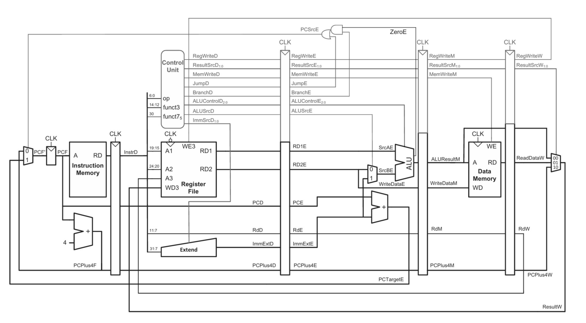
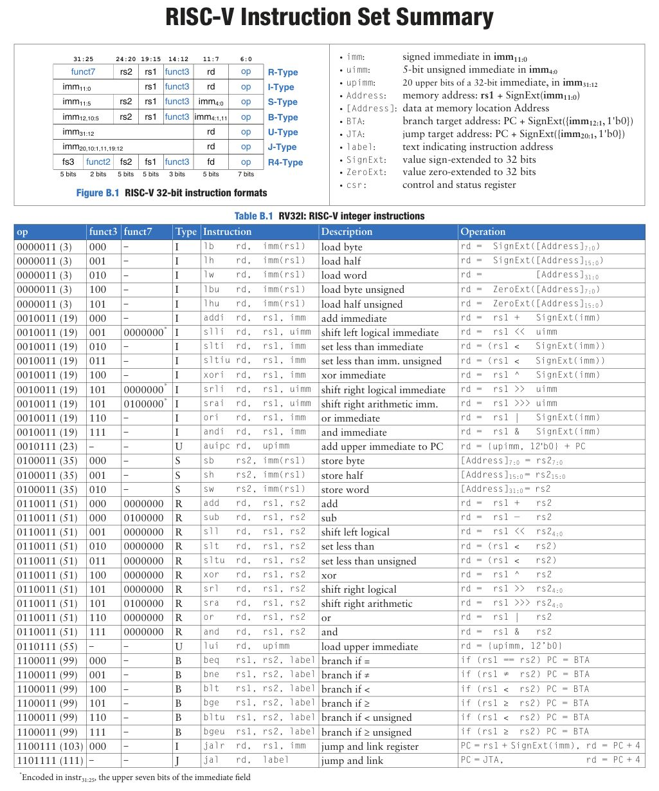
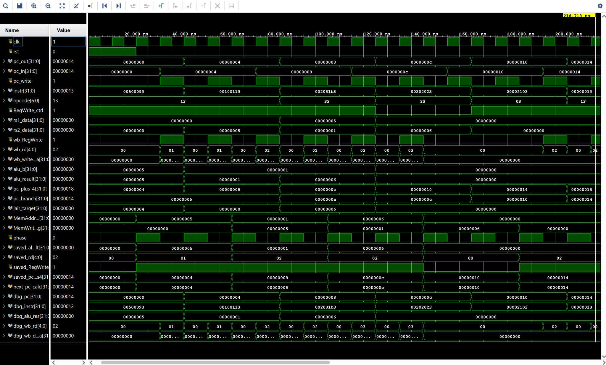
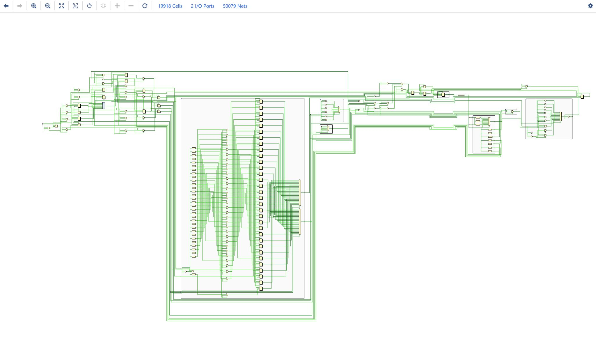
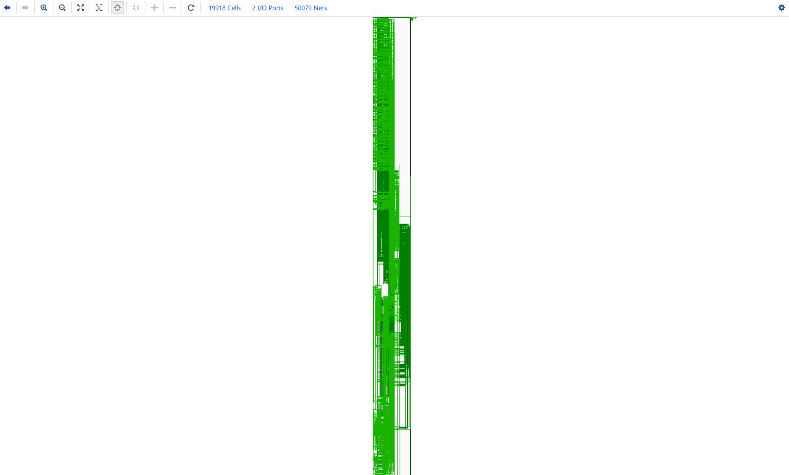

# RISC-V Single Cycle Processor (RV32I)

## Overview 📌
This project presents the design and implementation of a **32-bit RISC-V Single Cycle Processor** compliant with the **RV32I base integer instruction set**.  
The processor is developed using **Verilog HDL**, functionally verified through simulation, and synthesized to validate logical correctness and hardware feasibility.

In a single-cycle architecture, **each instruction completes execution in one clock cycle**, making this design simple, deterministic, and ideal for understanding processor fundamentals.

---

## Key Features ✨
- RV32I compliant instruction execution  
- Single-cycle datapath architecture  
- Supports arithmetic, logical, memory, branch, and jump instructions  
- Modular and hierarchical Verilog design  
- Verified using simulation waveforms  
- Successfully synthesized netlist  

---

## Processor Architecture 🏗️
The processor follows a **single-cycle datapath**, where instruction fetch, decode, execute, memory access, and write-back occur within one clock cycle.

### Major Components:
- Program Counter (PC)  
- Instruction Memory  
- Register File  
- Immediate Generator  
- Control Unit  
- Arithmetic Logic Unit (ALU)  
- Data Memory  
- Write-Back Multiplexer  

### Architecture Diagram
<p align="center">
  
</p>

---

## Supported Instruction Set (RV32I) 
The processor supports the **RISC-V RV32I base integer instruction set**.

### Instruction Types:
- **R-Type** – Register-register arithmetic and logical operations  
- **I-Type** – Immediate arithmetic, load, and jump-register instructions  
- **S-Type** – Store instructions  
- **B-Type** – Conditional branch instructions  
- **U-Type** – Upper immediate instructions  
- **J-Type** – Jump instructions  

### Instruction Set Summary
<p align="center">
  
</p>

---

## Simulation & Verification
The design was verified using testbenches to ensure correct functionality of:
- Instruction fetch and decode  
- ALU operations  
- Register write-back  
- Branch and jump execution  
- Memory read/write operations  

### Simulation Waveforms
<p align="center">
  
</p>

---

## Synthesis Results 🛠️
The processor was synthesized successfully, generating a structurally correct netlist. This confirms that the RTL design is free from logical inconsistencies and is suitable for hardware implementation.

### Synthesized Netlist
<p align="center">
  
</p>

<p align="center">
  
</p>

---

## Tools & Technologies
- Hardware Description Language: Verilog HDL
- Simulation Tools: Xilinx Vivado Simulator / ModelSim
- Synthesis Tool: Xilinx Vivado
- ISA Standard: RISC-V RV32I
- Design Methodology: RTL Design → Functional Simulation → Synthesis

---

## Project Structure 🧩
```text
├── rtl/
│   ├── alu.v
│   ├── control_unit.v
│   ├── register_file.v
│   ├── immediate_gen.v
│   ├── datapath.v
│   └── top.v
├── tb/
│   └── cpu_top_tb.v
│   └── alu_tb.v
│   └── branch_unit_tb.v
│   └── control_unit_tb.v
│   └── data_memory_tb.v
│   └── data.mem
│   └── immediate_gen_tb.v
│   └── instr_memory_tb.v
│   └── mux2_tb.v
│   └── pc_adder_tb.v
│   └── pc_tb.v
│   └── program.mem
│   └── register_file_tb.v
├── images/
│   ├── Architecture_diagram.jpg
│   ├── instruction_set_summary.jpg
│   ├── sim.jpg
│   ├── synthesis_diagram1.jpg
│   └── synthesis_diagram2.jpg
└── README.md

